<!-- Slide number: 1 -->
# 基礎実習　Ⅱ Universal Design  

<!-- Slide number: 2 -->
## リサーチ１　通常の使い方  
ピーラー
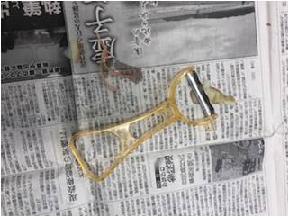
包丁
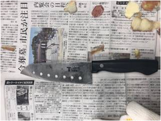

すりおろし器
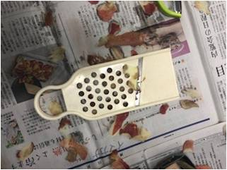

<!-- Slide number: 3 -->
## リサーチ１ 通常の使い方からわかったこと  
利き手が道具を切る役割を担っている一方、反対の手はりんごを抑える役割である。  
 →りんごに力をかけやすい、角度を調整しやすい  
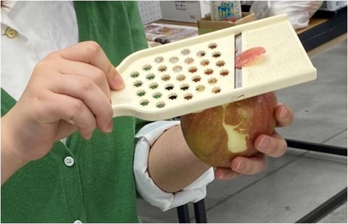
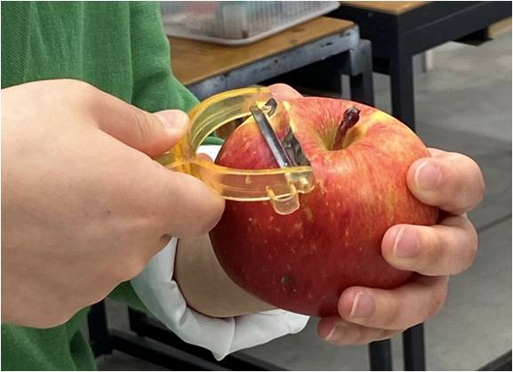

<!-- Slide number: 4 -->
### 全部の道具に言えること  
・削りだしが一番力がかかる  
・しっかり固定しないとりんごが転がっていく  
・下のカーブまで一回ではむきづらい  
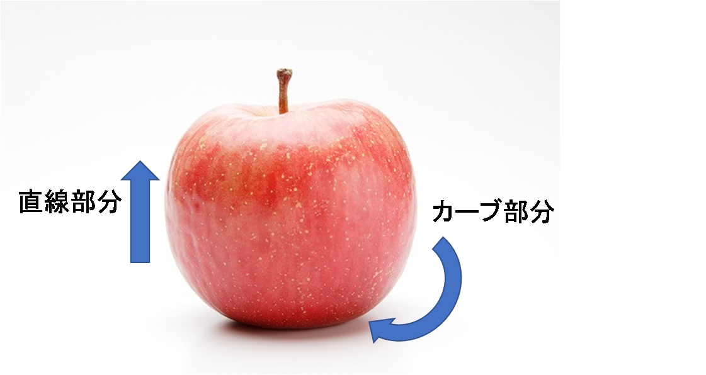

<!-- Slide number: 5 -->
## リサーチ２ 身体的な違いを想定して…  
###テープで指を固定して、片手かつ小指がない想定  
横むきタイプで実験 →多少ぐらつくものの、とくに不自由せず使えた  
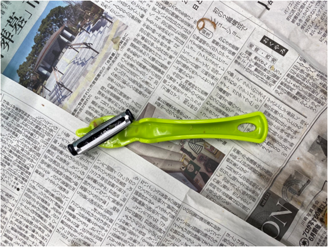
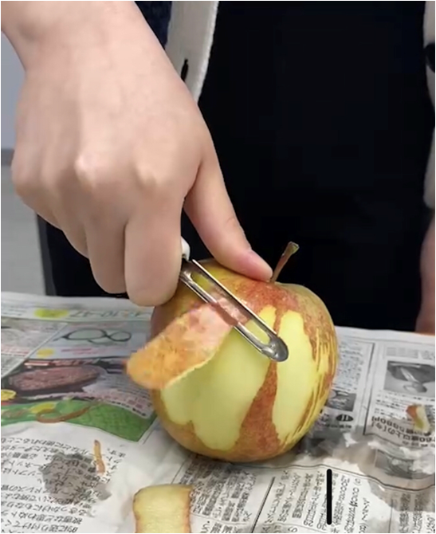

<!-- Slide number: 6 -->
### テープで親指固定、片手かつ親指がない想定
→親指を支点に力をかけられなくなる  
まったくりんごをむくことができなかった。  
横向きタイプなら直線部分だけむけた。  
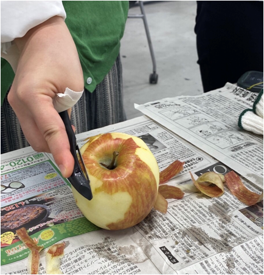
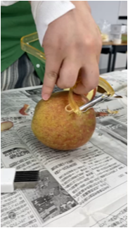

<!-- Slide number: 7 -->
### テープで関節を固定してみた  
→指を曲げづらくなる状態。  
力が入りづらく、最初はりんごをむくのに苦戦していた様子。  
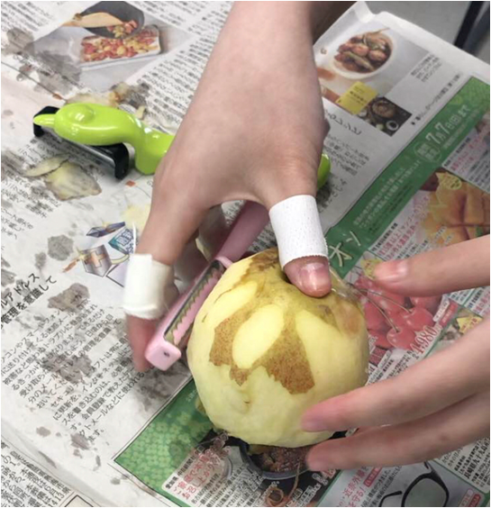

<!-- Slide number: 8 -->
## リサーチ２　身体的な違いからわかったこと  
親指が無い想定が一番むきにくかった。なぜか？  
→親指が他の四本指にはない動きをするから。  
親指は四本指と違う方向に曲がる  
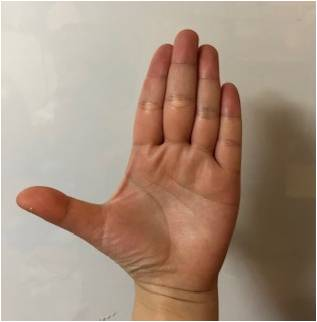
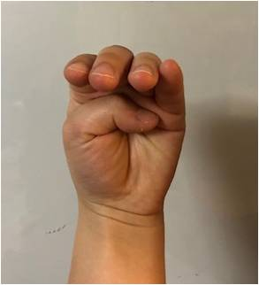

<!-- Slide number: 9 -->
## リサーチ３ 片手での作業
### ピーラーA  
持ち手が大きいため、片手の時少し持ちづらかった。  
下の曲線はむきづらいが、上半分はむける。  
りんごのへたにあるくぼみに親指をいれるとやりやすかった。  
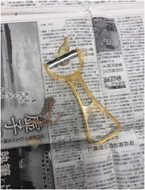

<!-- Slide number: 10 -->
### ピーラーB  
この持ち方は、安定せず削りづらかった。→  
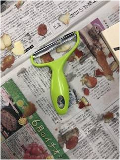
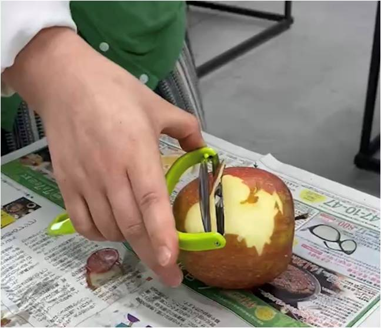

親指で刃の近くのカーブを持ち、4本指をリンゴに押し当てることで  
刃を動かすと削りやすかった。  
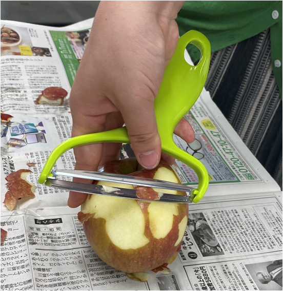

<!-- Slide number: 11 -->
### ピーラーC  
このタイプのピーラーは、刃をしっかり当てないと切れない。  
片手ではりんごが転がってしまった。  
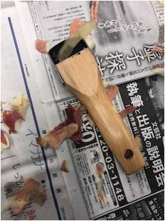
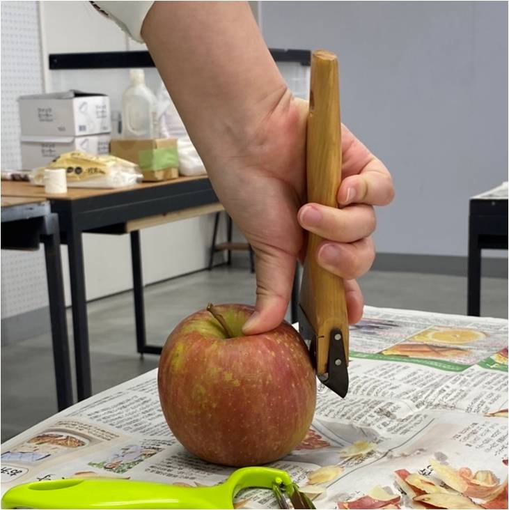

<!-- Slide number: 12 -->
### ピーラーD  
刃がギザギザしているため、りんごに刃を入れづらかった。  
また、持ち手が使っているものの中でも、長く、幅が広かったため、  
片手では使いづらかった。  
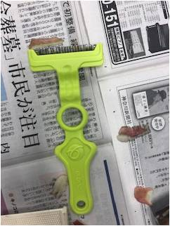
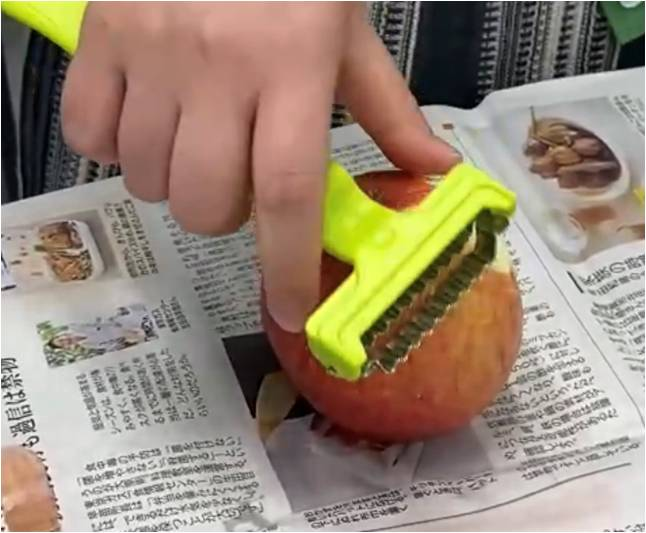

<!-- Slide number: 13 -->
### すりおろし器  
切りたい対象を刃に当て上下に動かすことで切れるので、片手では  
ほとんどりんごをむけなかった。
片手では、りんごをおしつけて固定する方法がない。  
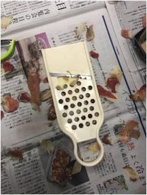

<!-- Slide number: 14 -->

### 包丁
両手の時は一番使いやすかったが、片手となると、刃がりんごに深く  
切り込みを入れてしまい、切りづらかった。  
刃がむきだしの構造であるため、怪我をしそう。  
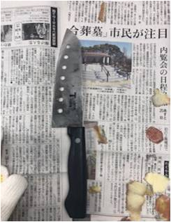
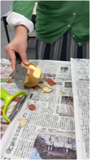

<!-- Slide number: 15 -->
### 横向きタイプ  
使ってきた道具の中で一番りんごをむきやすかった。  
横にしてむくから持ち手が邪魔にならないし、力の入れ方として安定する。  
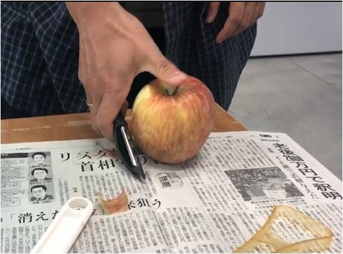

<!-- Slide number: 16 -->
## 考察１　ユーザーの違い  
### 力の強弱  
片手で試したものの中には手が麻痺していて、力が入りづらい人には難しそうな切り方などもあった。  
### 慣れている道具の形  
普段使い慣れている形（包丁、ピーラー、はさみ、カッター）に近い形のほうが使い方を想像しやすい  。
### 手の大小  
りんごを覆える手の大きさのほうが安定する。  

<!-- Slide number: 17 -->
## 考察２　手の動きや働きについて  
親指が手の動きの中で重要な役割をしていることがわかった。  
→一本だけ違う方向を向いているから、なにかに引っかけたり、物を固定するとき四本指の反対側から力をかけられる。  
ものを引き寄せる動き（手をパーからグーに戻す動き）が片手でむくとき、やりやすかった。  
→刃を当てて動かさなくてはいけないので、指は自然とものを引き寄せる動きに似るのかもしれない。  
